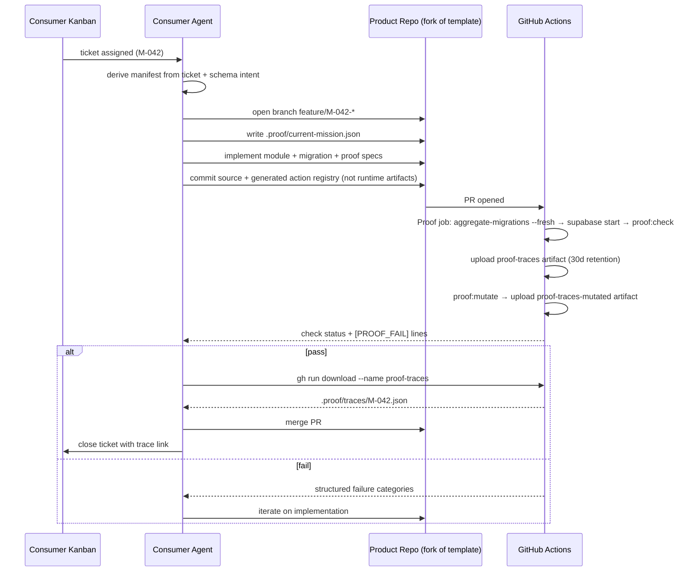

# Proof Harness — Consumer Integration Contract

This document describes what an external consumer (an orchestrator, bespoke
automation, or a human developer in manual mode) must do to drive a product
repository through mission-based verification.

If you are building the template, see [`.cursor/rules/proof-authoring.mdc`](.cursor/rules/proof-authoring.mdc)
instead; this document is for anyone _consuming_ the template.

> **"Manifest" in this document always means the _mission_ manifest**
> (`.proof/current-mission.json`) — the file that pins what one PR must prove.
> It is unrelated to a **module descriptor** (`module.meta.ts` →
> `.proof/modules.json`), which describes what a module is for and what a buyer
> must decide before using it. See §3.1 below.

- **Version:** 1 (`schemaVersion` in every manifest and artifact)
- **Stability:** The shapes in this document are the contract. Additive
  changes (new optional fields, new vocabulary entries) do not bump the
  version; breaking changes bump `schemaVersion` and are documented here.
- **Last reconciled:** August 2026. The migration aggregate and the
  `capabilities.json` / `schema.json` artifacts are **derived build artifacts,
  regenerated from source in setup and CI, and are not committed** (see §2/§3).
  Earlier revisions of this doc described them as committed and regenerated by a
  pre-commit hook; that is no longer true.

---

## 1. The loop

```
┌──────────────────────────────────────────────────────────────────────┐
│                                                                      │
│   1.  Consumer writes  .proof/current-mission.json  (manifest)       │
│   2.  Coding agent implements feature + proof specs + migrations     │
│         (migrations live in app/**/src/db/migrations/*.sql — source)  │
│   3.  Consumer opens PR                                              │
│   4.  GHA  Proof  job runs:                                          │
│         ├─ pnpm aggregate-migrations --fresh                         │
│         │     (rebuilds the gitignored supabase/migrations aggregate) │
│         ├─ supabase start (local stack + migrations + seed users)    │
│         ├─ playwright install                                        │
│         └─ pnpm proof:check                                          │
│             ├─ proof:migrations → diffs module SQL vs the PR base;    │
│             │    shipped files are immutable, new files must not      │
│             │    quietly loosen constraints                           │
│             ├─ proof:build → regenerates capabilities.json + schema  │
│             │                 .json and verifies action registry      │
│             ├─ proof:drift → diffs the proof surfaces vs the PR      │
│             │    base right after proof:build, so undeclared scope   │
│             │    fails cheaply BEFORE the database proofs run        │
│             ├─ proof:verify                                          │
│                 ├─ runs every *.proof.ts spec                        │
│                 ├─ aggregates  .proof/traces/<missionId>.json        │
│                 └─ validates manifest requirements against artifacts │
│             ├─ proof:coverage --strict                               │
│             └─ proof:inventory → requires mutation or acceptance      │
│         then uploads  .proof/traces/  as  proof-traces  and          │
│         .proof/drift.json  as  proof-drift  artifacts                │
│   5.  On pass:  PR mergeable; trace artifact is the durable evidence │
│        On fail: CI log contains  [PROOF_FAIL]  lines; agent iterates │
│   6.  Consumer downloads  proof-traces  artifact via  gh run download│
│       and closes its ticket.                                         │
│                                                                      │
└──────────────────────────────────────────────────────────────────────┘
```

> Runtime artifacts are not committed: the migration aggregate
> (`supabase/migrations/…_initial.sql`), `.proof/capabilities.json`, and
> `.proof/schema.json` are rebuilt on every setup and CI run. The generated
> TypeScript action registry is the deliberate exception: it is committed
> because ordinary fresh-checkout `build` and `typecheck` jobs import it without
> running `proof:build`. Run `pnpm proof:registry` after changing action
> requirements or probes; `proof:build` fails if the committed result is stale.

---

## 2. Inputs the consumer owns

Everything the consumer writes into the product repo.

| Input            | Location                                                | Purpose                                                                                                                                                                                                                                                                                                                                            |
| ---------------- | ------------------------------------------------------- | -------------------------------------------------------------------------------------------------------------------------------------------------------------------------------------------------------------------------------------------------------------------------------------------------------------------------------------------------- |
| Mission manifest | `.proof/current-mission.json`                           | Pins what this PR must prove (capabilities, schema, traces).                                                                                                                                                                                                                                                                                       |
| Feature code     | `app/__business-logic/<module>/`                        | The implementation. Template conventions in `AGENTS.md`.                                                                                                                                                                                                                                                                                           |
| Proof specs      | `e2e/proofs/<feature>.proof.ts`                         | Playwright tests that emit structured traces.                                                                                                                                                                                                                                                                                                      |
| Migrations       | `app/__business-logic/<module>/src/db/migrations/*.sql` | Schema + RLS policies. The **tracked source of truth**; the `supabase/migrations/` aggregate is rebuilt from these by `pnpm aggregate-migrations --fresh` and is gitignored. Files already on the PR base are immutable; `pnpm proof:migrations` rejects edits/deletes and constraint-loosening unless accepted in `.proof/migration-policy.json`. |

> **The template ships without `.proof/current-mission.json`.** That is
> deliberate: with no manifest present, `pnpm proof:verify` runs in
> no-manifest mode (see §7) and never gates on requirements the consumer
> hasn't written yet. The consumer writes this file per PR. A reference
> manifest is included at [`.proof/missions/M-TEST-001.json`](.proof/missions/M-TEST-001.json)
> as a copy-ready starting point.
>
> The opt-in [autonomous factory profile](AUTONOMOUS_FACTORY.md) is stricter:
> its external planner or human administrator establishes the active mission on
> the protected base before the executor branch starts. The required Keystone
> check then rejects executor changes to that mission, proof specs, Proof SDK,
> policies, workflows, and seed data. This profile is disabled by default.

### Mission manifest shape

See [`src/shared/mission-types.ts`](src/shared/mission-types.ts)
for the canonical TypeScript types and [`.proof/current-mission.example.json`](.proof/current-mission.example.json)
for a worked example. The full schema:

```jsonc
{
  "schemaVersion": 1,
  "missionId": "M-042", // stable ticket id; also the filename of the merged trace
  "missionTitle": "Add issue tracking with assignees",
  "productRepo": "example-org/acme-issues", // informational
  "prBranch": "feature/M-042-issue-tracking", // informational
  "createdAt": "2026-04-16T10:30:00Z", // ISO-8601
  "requirements": {
    "capabilities_must_exist": [
      // server actions that must exist and declare the expected withProof
      {
        "name": "createIssue", // must equal createAction({ functionName })
        "module": "issues", // leaf folder name under __business-logic/
        "verb": "create", // one of PROOF_VERBS
        "object": "issue", // free-form noun
        "invariants": ["tenant_isolation"], // optional; strings that must appear in withProof({ invariants })
      },
    ],
    "schema_must_contain": [
      // tables that must exist with a specific shape and RLS stance
      {
        "table": "issues",
        "required_columns": [
          "id",
          "title",
          "workspace_id",
          "assignee_id",
          "status",
        ],
        "rls_classification": "workspace_scoped", // one of RLS_CLASSIFICATIONS
      },
    ],
    "policies_must_not_allow": [
      // optional. Per-command claims about RLS policies, for the cases one
      // rls_classification label cannot express. See Policy prohibitions.
      {
        "table": "audit_logs",
        "role": "authenticated", // database role no policy may target
        "commands": ["INSERT", "UPDATE", "DELETE"], // optional; omit to mean any command
        "description": "members never write to the audit log; only the service role does",
      },
    ],
    "trace_must_prove": [
      // assertion targets that must pass in the aggregated trace
      {
        "kind": "happy_path", // one of PROOF_KINDS
        "target": "create_issue", // matches the `target` emitted by the assertion
        "description": "A workspace member can create an issue in their workspace",
        "role": "primary", // optional, defaults to "primary"; see Assertion roles
        "proofId": "issues-create-happy-path", // optional; pin the requirement to one spec
        "evidence": "helper", // optional; see Assertion provenance. Defaults to
        // "helper" for tenant_isolation and "any" for every other kind.
      },
    ],
  },
  "expectedChanges": {
    // optional drift budget; see Proof-surface drift report. Omitting the
    // block keeps proof:drift report-only.
    "modules": ["issues"], // covers ONLY added actions in these modules
    "actions": [
      // exact refs; string = any change, object narrows the change kinds
      { "ref": "workspace:removeMember", "changes": ["modified"] },
    ],
    "tables": [
      "issues", // string = any change to this table
      { "name": "workspaces", "changes": ["columns_added"] }, // facet-narrowed
    ],
    "dependencies": [], // runtime deps that may be added/removed/version-changed
    "lockfile": false, // true to accept a lockfile-only resolution change
  },
  "acceptanceNotes": "free-form notes for reviewers and the coding agent",
}
```

### Rules the consumer's agent MUST follow

- Every `trace_must_prove` entry needs at least one proof spec whose step emits
  a matching `{ kind, target, passed: true }` assertion via `assert.*` helpers.
  Raw `expect(...)` calls do not count — only helper-driven assertions populate
  the `assertions[]` array the validator reads.
- A requirement is satisfied only by an assertion of the same **role**
  (see [Assertion roles](#assertion-roles)). A passing control assertion never
  satisfies a `primary` requirement.
- A `tenant_isolation` requirement is satisfied only by an assertion whose
  `emittedBy` identity is allowed for its target: `assert.tenantIsolation` for
  tables, plus `assert.authorization` for action refs (see
  [Assertion provenance](#assertion-provenance)). A hand-rolled
  `recordAssertion` — or a caller-kind helper like `assert.httpResponse` —
  fails as `trace_unverified`, and there is no `evidence: "any"` opt-out for
  isolation claims.
- Set `proofId` on a requirement when the claim must come from one specific spec.
  Without it, any spec in the run may satisfy it.
- `capabilities_must_exist[].name` must exactly match an action's
  `createAction({ functionName: "..." })` argument.
- `schema_must_contain[].rls_classification` must be one of the closed values
  in [`RLS_CLASSIFICATIONS`](src/shared/vocabulary.ts). The
  migration parser only emits these values; a manifest that asks for anything
  else fails at the shape-validation step.
- Do not commit or hand-edit `.proof/capabilities.json` or
  `.proof/schema.json`. They are gitignored, derived build artifacts,
  regenerated from source by `pnpm proof:build` (`proof:scan` + `proof:parse`)
  during setup and in CI before `proof:verify` runs. Before schema parsing,
  `proof:build` non-mutatingly verifies that every module migration, generated
  SQL file, source-to-output mapping, and manifest hash agrees; stale aggregates
  fail with an instruction to run `pnpm aggregate-migrations --fresh`.
  `proof:build` also verifies that the committed generated action registry is current; use
  `pnpm proof:registry` to update it. `schema.json` is parsed
  from the gitignored migration aggregate, so a committed copy would encode a
  stale, unverifiable `initial.sql` filename. If you need them locally, run
  `pnpm proof:build` (or `pnpm aggregate-migrations --fresh && pnpm proof:build`).

### Capability map derived security fields

Each capability keeps the optional `withProof` fields and also carries scanner
facts used by schema-wide coverage:

```jsonc
{
  "name": "updateWidget",
  "module": "widgets",
  "acceptsWorkspaceId": true,
  "internalOnly": false,
  "usesDirectUpdateTag": false,
  "serviceRoleMutations": [{ "table": "widgets", "operation": "update" }],
  "middleware": {
    "auth": true,
    "tenantIsolation": true,
    "rbac": true,
  },
}
```

`acceptsWorkspaceId` plus a non-empty `serviceRoleMutations` list derives a
mandatory action boundary unless `internalOnly` marks `_BOT`/`server-only`
plumbing. `middleware` is diagnostic context, not proof: coverage still demands
behavioral evidence if a generated action forgot one of those guards.
`usesDirectUpdateTag` blocks registry generation until the action switches to
`updateTagSafe`, because the proof endpoint invokes it through a Route Handler.

### Policy prohibitions

`rls_classification` gives a table one label. Postgres RLS is per-command, so a
table can be readable only by admins while being writable only by the service
role, and no single label says that. `policies_must_not_allow` covers the gap:

```jsonc
{
  "table": "audit_logs",
  "role": "authenticated",
  "commands": ["INSERT", "UPDATE", "DELETE"], // omit for "any command"
  "description": "members never write to the audit log; only the service role does",
}
```

The validator reads the `policies[]` array in `.proof/schema.json` and fails with
`schema_policy_permits`, naming every policy that grants the forbidden access.

**What it checks is reachability, not the predicate.** The claim is "no policy on
this table targets this role for these commands" — it does not read `USING` or
`WITH CHECK`. So `audit_logs` in this template, whose read policy is
`TO authenticated USING (is_super_admin())`, would _fail_ a prohibition on
`authenticated` + `SELECT` even though only admins can actually read a row. Write
prohibitions like the one above are the natural fit; "this role may act only under
condition X" is a behavioural claim and belongs in `trace_must_prove`, where
something exercises it. Three more rules worth knowing:

- A policy with no `TO` clause defaults to `PUBLIC` in Postgres, so it counts as
  granting **every** role — including the one you forbade.
- A policy declared `FOR ALL` matches whatever commands you listed, because that
  is what it does in the database.
- A prohibition naming a table that does not exist fails with `schema_missing`
  rather than passing, since a claim about nothing is satisfied by accident.

There is deliberately **no** positive form ("a policy must exist"). A policy's
existence says a rule was written, not that it works; a permission that must hold
belongs in `trace_must_prove`, where something actually exercises it. A
prohibition is the asymmetric case: it is checkable from the migrations alone, and
it fails silently and dangerously when nobody checks.

### Assertion roles

Every assertion carries a `role` that says what it is evidence _of_:

| Role      | Meaning                                                                               |
| --------- | ------------------------------------------------------------------------------------- |
| `primary` | The claim itself — "the outsider could not read org A's rows". The default.           |
| `control` | A sanity check that makes the primary claim meaningful — "the owner _can_ read them". |

The distinction exists because a security assertion can pass for the wrong
reason. "User B saw 0 rows" is satisfied both by working RLS and by a table that
is empty, missing, or denied to everyone. `assert.tenantIsolation` therefore also
proves the owner _can_ read their own rows and records that as a `control`.

Both roles land in the trace, so a reviewer can see the control was run — but only
`primary` assertions satisfy a `primary` requirement. Without the split, a mission
asking for tenant isolation could be signed off by a blanket `USING (false)`
policy that denies everybody, which is a bug, not isolation.

Security assertions also record the concrete `operation`: `select`, `insert`,
`update`, `delete`, `invoke`, or `request`. Mutation inventory keys a claim by
`{ kind, target, operation }`; proving that a SELECT check can turn red does not
silently cover an UPDATE or server-action invocation against the same target.

`"negative"` and `"positive_control"` are accepted as deprecated aliases for
`primary` and `control` respectively.

### Assertion status

`passed` stays the authoritative boolean — only `true` is evidence — but a
boolean cannot express "we did not find out", and that outcome is real. Every
assertion therefore also carries a `status`:

| Status       | `passed` | Meaning                                                                                       |
| ------------ | -------- | --------------------------------------------------------------------------------------------- |
| `passed`     | `true`   | The claim held.                                                                               |
| `failed`     | `false`  | The claim was tested and did not hold.                                                        |
| `incomplete` | `false`  | The probe ran but could not reach a verdict — a precondition was missing.                     |
| `skipped`    | `false`  | The probe was deliberately not run, e.g. an isolation direction with no fixture on that side. |

Rounding a non-verdict to `true` is how a suite quietly stops proving anything;
rounding it to `false` makes a skip indistinguishable from a real failure. The
status keeps them apart while `passed: false` keeps them out of the evidence:
neither `incomplete` nor `skipped` can satisfy a requirement.

Where this shows up in practice: `assert.tenantIsolation` proves both directions
when its fixture populates both tenants, and records the reverse direction as
`skipped` when it does not. A factory that leaves the primary side empty records
`incomplete` and fails as `tenant_isolation_vacuous`; zero rows can never become
green evidence.

Per-proof tallies are in the aggregate under `proofs[].assertionStatus`, so a
consumer can spot a green run containing skips without walking every assertion.

`status` is absent on traces written before it existed; derive it from `passed`
(`passed ? "passed" : "failed"`), which is what the SDK does.

### Assertion provenance

Every assertion an `assert.*` helper emits carries `emittedBy` — the helper's
name, e.g. `"assert.tenantIsolation"`. The field is stamped by the SDK through
an internal channel: the public `recordAssertion(...)` strips any
caller-supplied value, so spec code cannot impersonate a helper. An assertion
without `emittedBy` was recorded directly by a spec.

The distinction is evidential, not cosmetic. A helper-emitted assertion went
through the helper's vacuity controls, positive controls, and service-role
ground-truth re-reads; a spec-recorded assertion asserts whatever the spec
chose to write into it. `trace_must_prove` entries therefore accept an
optional `evidence` field:

| Value      | Meaning                                                                |
| ---------- | ---------------------------------------------------------------------- |
| `"helper"` | Only assertions with helper provenance satisfy this requirement.       |
| `"any"`    | Spec-recorded assertions count too (mutation inventory still applies). |

**Tenant isolation is always `"helper"` — there is no opt-out.** Declaring
`evidence: "any"` for a `tenant_isolation` requirement fails as
`manifest_shape`: strict coverage rejects raw isolation assertions
unconditionally, and the mission gate must never accept what coverage
refuses. Every other kind defaults to `"any"`, because bespoke probes (RPC
grants, column guards) are legitimate there and remain backstopped by the
mutation inventory.

**For tenant isolation the stamp is identity-checked, not merely
present-checked.** Helpers differ in who chooses the `kind`:
`assert.httpResponse` records its caller's kind verbatim, so its stamp on a
`tenant_isolation` assertion would prove only that an HTTP probe ran. The
allowed identities are:

| Target                     | Accepted `emittedBy`                             |
| -------------------------- | ------------------------------------------------ |
| A table in `schema.json`   | `assert.tenantIsolation` only                    |
| Anything else (action ref) | `assert.tenantIsolation`, `assert.authorization` |

**User callbacks never inherit the stamp.** Provenance is suspended around
every executor-authored callback a helper invokes (`fixture.create`,
`setup`), so a hostile fixture calling `recordAssertion` mid-helper records an
unstamped assertion.

A matching passing assertion that fails only the provenance requirement is
reported as `trace_unverified`, not `trace_missing`, since the fix is
different: emit through the owning helper, or (for non-isolation kinds) set
`evidence: "any"` deliberately.

`pnpm proof:coverage` applies the same identity rules: a passing primary
`tenant_isolation` assertion with the wrong (or no) origin does not count
toward a table's invariant or a service-role action boundary, and is listed in
the report's `UNVERIFIED ORIGIN` section with its actual origin.

`emittedBy` is absent on traces written before it existed; treat absence as
"origin unknown" (which is why fresh verification, never old traces, feeds the
validator). Provenance is a validator-visible guarantee, not a hard sandbox: a
spec deep-importing SDK internals could reach the stamping channel. The
factory profile's Keystone protection of the SDK and specs closes that; in
tandem mode the raised bar plus mutation inventory is the honest claim.

### Proof-surface drift report

`pnpm proof:drift` (running directly after `proof:build`, so undeclared
scope is rejected cheaply before the database-backed proofs start) answers
the question the mission validator cannot: **what else did this PR do — on
the surfaces the proof system can see?** It regenerates `capabilities.json` and `schema.json`
from the PR's merge base (via `git archive` + the base checkout's own
generator scripts — no database needed), diffs them, `package.json`, and the
lockfile-changed signal against the head, and writes `.proof/drift.json`
(gitignored) plus a printed table of every delta:

| Severity | Deltas                                                                                                                                                                                                                                                                     |
| -------- | -------------------------------------------------------------------------------------------------------------------------------------------------------------------------------------------------------------------------------------------------------------------------- |
| `high`   | action added/removed/changed (incl. weakened middleware, new service-role mutations); table added/removed/reshaped (columns, RLS classification, policies incl. **role lists**); ANY runtime dependency delta (add/remove/version change); lockfile-only resolution change |
| `info`   | action file moved; devDependency added; lockfile change accompanying package.json dependency changes                                                                                                                                                                       |

**What drift does NOT see.** It grades exactly the scanner-derived surfaces,
and calling it more would be dishonest: RLS policy **predicates**
(`USING` / `WITH CHECK` bodies) are not parsed — only name, command, and role
list; column types, constraints, and defaults; SQL grants, triggers, and
function bodies; transitive dependency contents; and ordinary product
behavior are all invisible to it. "No drift" means "no change on the
proof-relevant derived surfaces", never "nothing else changed" — behavior
inside declared scope still merits review or a `trace_must_prove` entry.

Without an `expectedChanges` budget in the mission, the report is
informational. With one, every high-severity delta must fall inside the
declared budget or the check fails with `drift_undeclared`, naming the change
and the missing declaration. The budget is narrow by default:

- `modules` covers **only added actions** in the named module (the new-module
  convenience). Modifying or removing an existing action is never authorized
  by a module declaration.
- `actions` names exact `module:name` refs. A bare string allows any change;
  `{ "ref": "...", "changes": [...] }` narrows to facets (`added` ·
  `removed` · `middleware_changed` · `invariants_changed` ·
  `service_role_mutations_changed` · `metadata_changed`). A modified action
  is covered only when **every** facet of the change is declared — declaring
  `invariants_changed` does not authorize an RBAC/auth middleware change on
  the same action.
- `tables` names tables. A bare string allows any change;
  `{ "name": "...", "changes": [...] }` narrows to facets (`added` ·
  `removed` · `columns_added` · `columns_removed` ·
  `rls_classification_changed` · `policies_changed`). A modified table is
  covered only when **every** facet of the change is declared — declaring
  `columns_added` does not authorize a policy edit on the same table.
- `dependencies` names packages; a declared name covers add, remove, and
  version change alike.
- `lockfile: true` accepts a lockfile-only resolution change (the lockfile
  moved while the `package.json` dependency surface did not) — high-severity
  because it means what ships changed with no visible dependency edit.

Budget that saw no change is reported ("declared but unchanged"), not failed.

CI uploads `.proof/drift.json` as the `proof-drift` workflow artifact (30-day
retention, alongside `proof-traces`), so a consumer reads the structured
report the same way it reads the traces — `gh run download --name
proof-drift`.

**Enforced drift fails closed.** When the mission declares a budget and the
drift check cannot be assessed — base unresolvable, base artifacts
unbuildable — it fails with `drift_unassessed` instead of exiting 0; a gate
that skips on breakage is not a gate. A malformed `expectedChanges` block
(or an unparseable mission file) likewise fails `proof:drift` itself as
`manifest_shape`, even standalone, rather than downgrading to report-only. Report-only mode (no budget) stays
permissive so unusual local checkouts never break on this step. The base is
the PR base in CI (`PROOF_DRIFT_BASE`, set by the workflow) and the merge
base with `origin/main`/`main` locally; an explicitly supplied base that does
not resolve fails loudly in either mode.

### Pre-schema fixture contract

A proof may be authored before the migration that defines its valid row shape.
In that state, create `e2e/fixtures/<table>.ts` with
`pendingProofFixture("<table>", reason)` and pass it to
`assert.tenantIsolation({ table, fixture })`. The run records a primary
`incomplete` assertion and fails with `fixture_factory_required`; the unfinished
proof cannot satisfy a mission.

After the schema settles, the builder replaces the placeholder with
`defineProofFixture({ table, create })`. The factory receives the two seeded
workspaces, two seeded users, and the service-role client. Required foreign keys
must resolve to those handles or rows the factory explicitly creates, while
`CHECK`, domain, and enum values must come from the real product schema. A
factory declares its table at runtime, so accidentally importing a copied
factory for another target fails as `fixture_factory_mismatch` before insertion.

The planner-owned proof, not the executor-owned factory, defines which semantic
rows count as evidence. `assert.tenantIsolation` accepts an optional
`criterion: { description, where }`; the equality filter is combined with each
side's tenant scope for the service-role ground-truth count, the owner's positive
control, and the outsider probe. For example, a proof may require
`{ description: "published widgets", where: { status: "published" } }`.

Rows that satisfy tenant scope but not the criterion do not rescue an empty
proof: if the primary side has no matching row, the assertion is `incomplete`
and fails as `tenant_isolation_vacuous`; if the reverse side has none, that
direction is recorded as `skipped`. The criterion may not contain the resolved
scope column because the helper supplies a different scope value for each
direction. This keeps autonomous-factory handoff honest: an executor can build a
constraint-valid fixture, but cannot silently redefine the semantic subset
stated by the protected proof.

There is deliberately no adaptive `insertFixtureRow()` in v1. The derived schema
artifact retains table/column names and RLS classification, but not the types,
nullability, defaults, generated columns, foreign keys, checks, domains, or enum
members needed to synthesize a valid row without guessing. Iterating on database
errors would encode product decisions in a generic SDK and incentivize weakening
real constraints. Keep those decisions explicit in the table factory; see
[`e2e/fixtures/README.md`](e2e/fixtures/README.md).

### Closed vocabularies

Full definitions in [`src/shared/vocabulary.ts`](src/shared/vocabulary.ts).

| Vocabulary            | Allowed values                                                                                        |
| --------------------- | ----------------------------------------------------------------------------------------------------- |
| `PROOF_VERBS`         | `create` · `read` · `update` · `delete` · `invoke` · `transfer`                                       |
| `PROOF_KINDS`         | `happy_path` · `tenant_isolation` · `authorization` · `validation` · `error_handling` · `idempotency` |
| `AssertionRole`       | `primary` · `control` (aliases: `negative` → `primary`, `positive_control` → `control`)               |
| `AssertionStatus`     | `passed` · `failed` · `incomplete` · `skipped`                                                        |
| `ProofOperation`      | `select` · `insert` · `update` · `delete` · `invoke` · `request`                                      |
| `RLS_CLASSIFICATIONS` | `workspace_scoped` · `user_scoped` · `admin_only` · `public_read` · `service_only` · `unclassified`   |

---

## 3. Outputs the consumer reads

Everything the template produces that the consumer consumes.

| Output                      | Location                                                                       | Emitted by                                           | Cadence                                |
| --------------------------- | ------------------------------------------------------------------------------ | ---------------------------------------------------- | -------------------------------------- |
| Capability map              | `.proof/capabilities.json` (gitignored)                                        | `pnpm proof:scan` (via `proof:build` in setup/CI)    | Every setup + CI run                   |
| Module descriptors          | `.proof/modules.json` (gitignored)                                             | `pnpm proof:modules` (via `proof:build` in setup/CI) | Every setup + CI run                   |
| Schema + RLS classification | `.proof/schema.json` (gitignored)                                              | `pnpm proof:parse` (via `proof:build` in setup/CI)   | Every setup + CI run                   |
| Proof action allowlist      | `app/__shared/proof-runtime/action-registry.generated.ts`                      | `pnpm proof:registry`                                | When action requirements/probes change |
| PR verification status      | GitHub check `Proof`                                                           | `pnpm proof:check` in `.github/workflows/ci.yml`     | Every PR push                          |
| Per-spec trace              | `proof-traces` artifact → `<proofId>.json`                                     | `trace.proof()` helper during spec run               | Every PR push                          |
| Aggregated mission trace    | `proof-traces` artifact → `<missionId>.json`                                   | `pnpm proof:verify` aggregator                       | Every PR push                          |
| Mutation inventory          | CI log / local exit code                                                       | `pnpm proof:inventory` (via `proof:check`)           | Every proof check                      |
| Mutation detection traces   | `proof-traces-mutated` artifact                                                | `pnpm proof:mutate` (`proof:check:full` locally)     | Every PR push                          |
| Schema-wide coverage report | stdout (`--json` for machine-readable)                                         | `pnpm proof:coverage` (via `proof:check` in CI)      | Every PR push                          |
| Proof-surface drift report  | `proof-drift` artifact → `drift.json` (local: `.proof/drift.json`, gitignored) | `pnpm proof:drift` (via `proof:check`)               | Every proof check                      |
| Migration history vs base   | CI log / local exit code                                                       | `pnpm proof:migrations` (via `proof:check`)          | Every proof check                      |

> `capabilities.json` and `schema.json` are **not committed** — they are
> regenerated from source on every setup and CI run. A consumer that wants to
> inspect them reads the copy produced in its own CI run (or runs
> `pnpm proof:build` locally), not a copy from the repo. The generated action
> registry is committed and freshness-checked because application compilation
> imports it before proof artifacts necessarily exist.

### Reading the trace artifact

After the `Proof` check finishes (pass or fail), the full
`.proof/traces/` directory is uploaded as a workflow artifact named
`proof-traces` with a 30-day retention window. Consumers fetch it with the
GitHub CLI:

```bash
RUN_ID=$(gh run list \
  --workflow ci.yml \
  --branch "$PR_BRANCH" \
  --limit 1 \
  --json databaseId -q '.[0].databaseId')

# gh run download refuses to overwrite; always extract into a fresh dir.
rm -rf /tmp/proof && mkdir -p /tmp/proof
gh run download "$RUN_ID" --name proof-traces --dir /tmp/proof

# Single source of truth for pass/fail:
jq '.passed' "/tmp/proof/${MISSION_ID}.json"          # -> true | false
jq '.issues' "/tmp/proof/${MISSION_ID}.json"          # -> [] when passed, [{category, message, ...}, ...] when failed
jq '.proofs[] | {proofId, passed}' "/tmp/proof/${MISSION_ID}.json"  # per-spec verdicts
```

The aggregated `<missionId>.json` is the authoritative evidence for a
mission. It is **written on both pass and fail** — consumers should always
read `.passed`, never infer from file presence. Per-spec `<proofId>.json`
files sit alongside it for drill-down debugging.

The separate `proof-traces-mutated` artifact contains one directory per planted
defect under `<mutationId>/`. Every contained trace is an intentionally red (or,
when the harness finds a miss, unexpectedly green) run against that defect.
These files are detection evidence, not mission verdicts; never merge them into
the green `proof-traces` directory before validation.

### Canonical consumer conformance corpus

[`proof-consumer-fixtures/`](proof-consumer-fixtures/) is the executable
ingestion companion to this contract. Its [`corpus.json`](proof-consumer-fixtures/corpus.json)
indexes canonical passing, failing, mission-aggregate, mutation-directory,
duplicate, and malformed cases with their expected classification or rejection.
The template runs every case through focused tests, including the same mission
validator used by `pnpm proof:verify`.

An external orchestrator should run the whole corpus through its production
download and ingestion path. In particular, it must:

- classify aggregates before collecting per-spec traces, so the aggregate's
  embedded `traces` are not counted a second time;
- keep mutation directories separate from baseline evidence even when both
  contain `<proofId>.json` with the same filename;
- retain and cross-check the mutation ID from the directory, `mutation.json`,
  and each trace's `mutation` provenance instead of dropping it during
  normalization;
- reject duplicate baseline `proofId` values before a map, database upsert, or
  extraction step silently overwrites one run; and
- preserve `requirementEvidence` and verify that each satisfied entry still
  resolves to the named proof/spec and its passing assertion.

See the fixture [README](proof-consumer-fixtures/README.md) for the exact
ingestion expectations and the reference test command. GitHub permission
classification and repository-readiness polling remain downstream concerns;
they are integration-specific and deliberately absent from this template-core
corpus.

### Aggregated trace shape

```jsonc
{
  "schemaVersion": 1,
  "missionId": "M-042",
  "passed": true, // top-level verdict; consumers read this single boolean
  "aggregatedAt": "2026-04-16T11:00:00Z",
  "manifestSummary": {
    "missionTitle": "…",
    "capabilities_must_exist": 2,
    "schema_must_contain": 1,
    "trace_must_prove": 3,
  },
  // Empty [] on pass. On fail, every [PROOF_FAIL] the validator emitted
  // (same structure the logs print) so consumers never need to log-scrape.
  "issues": [
    // example failure entry, omitted when `passed: true`
    // { "category": "capability", "message": "…", "expected": "…", "found": "…" }
  ],
  // Which proof actually satisfied each requirement — attribution, so a
  // consumer never has to guess where a verdict came from.
  "requirementEvidence": [
    {
      "requirement": "trace:tenant_isolation:issues",
      "satisfied": true,
      "proofId": "issues-tenant-isolation",
      "specFile": "e2e/proofs/issues-tenant-isolation.proof.ts",
    },
  ],
  // What produced this run. Answers "which code emitted this evidence?".
  "provenance": {
    "commit": "a1b2c3d…",
    "branch": "feature/M-042-issue-tracking",
    "dirty": false, // true when the working tree had uncommitted changes
    "repository": "example-org/acme-issues",
    "ci": true,
    "command": "proof-harness verify",
    "nodeVersion": "v24.19.0",
    "platform": "linux",
  },
  "proofs": [
    {
      "proofId": "issues-create-happy-path",
      "missionId": "M-042", // null if the spec did not declare one
      "passed": true,
      "durationMs": 1234,
      "stepCount": 2,
      "assertionCount": 1,
      // Tally by status. `skipped` above 0 on a passing proof means a direction
      // was never measured — see "Assertion status".
      "assertionStatus": {
        "passed": 1,
        "failed": 0,
        "incomplete": 0,
        "skipped": 0,
      },
    },
  ],
  "traces": [
    /* the full TraceArtifact[] from .proof/traces/<proofId>.json for each spec */
  ],
}
```

Each per-spec `TraceArtifact` (`schemaVersion: 2`) additionally carries four
provenance fields, so a single `<proofId>.json` is self-contained evidence rather
than something that only means anything next to its aggregate:

| Field      | Answers                                                       |
| ---------- | ------------------------------------------------------------- |
| `specFile` | Which spec made this claim                                    |
| `specHash` | First 12 hex of SHA-256 of that spec's contents               |
| `commit`   | Which commit of the application it was made against           |
| `dirty`    | Whether the working tree had uncommitted changes at that time |
| `mutation` | Planted defect id and `planted: true`; absent on normal runs  |

A trace whose `specHash` does not match the spec in the PR was produced by
different code. A trace whose `commit` does not match the PR head describes
different code — which is what lets a consumer say "red at X, green at Y" and
mean it. `dirty: true` marks evidence gathered against a working tree that exists
on exactly one machine; a consumer gating on proofs should refuse it.

`commit` and `dirty` are absent, never fabricated, outside a git checkout —
shallow clones and exported tarballs still have to produce usable artifacts. On a
CI `pull_request` run, `commit` is the ephemeral merge commit the checkout
created: accurate about what was tested, but not a commit you can return to, so
record the PR head alongside it if you need to navigate back.

`pnpm proof:verify` clears previous top-level JSON traces before every normal
run, then resolves provenance once and passes it to the specs so every trace
agrees. In `--no-run` mode it preserves the supplied evidence but rejects traces
from another commit or whose `specFile` no longer exists with `stale_trace`.

---

### 3.1 Module descriptors — what exists, and what must be decided

`.proof/modules.json` answers a different question from everything else here.
The trace artifacts say _"this claim was proved"_; this one says _"this is what
exists, and this is what a buyer has to settle before it can be used"_. It is
what a planning agent reads instead of the template's source, which is the point:
without it the planner needs the codebase in its context, and that grows with
every module we write.

Regenerate it with `pnpm proof:modules`. Unlike `schema.json` it needs **no
Docker, database, or migration aggregate** — it reads the filesystem and
`capabilities.json`, and takes about a second.

Each entry has a declared half and a derived half:

```jsonc
{
  "schemaVersion": 1,
  "modules": [
    {
      // Declared in app/__core/<module>/module.meta.ts
      "id": "user-auth",
      "kind": "core", // core | extension | business | generated
      "purpose": "Signs people in and proves who they are — …",
      "env": [],
      "decisions": [
        {
          "id": "mfa_enforcement", // snake_case, unique across all modules
          "ask": "Must people use a second factor to sign in?",
          "because": "Stricter is safer but adds a step for everyone.",
          "options": [{ "value": "optional", "means": "…" }],
          "applied_by": "config", // config | content | code
          "applies": ["app/__core/user-auth/src/config.ts#MFA_POLICY"],
        },
      ],
      "inputs": [
        /* values the buyer supplies rather than picks */
      ],
      "defaults": [
        /* what we chose for them, each with a seam */
      ],

      // Derived from source — never written by hand
      "path": "app/__core/user-auth",
      "entities": [], // tables its own migrations create
      "requires": ["config", "user-management"],
      "uses_shared": ["ui", "db-supabase"],
      "actions": [{ "name": "signin", "verb": null, "object": null }],
      "proven": { "specs": 1, "mutations": 0 },
    },
  ],
  // Tables no descriptor claims — today, the ones owned by __shared modules.
  "unowned_tables": [
    {
      "table": "audit_logs",
      "module": "audit-logging",
      "path": "app/__shared/audit-logging",
    },
  ],
}
```

**Two audiences, one file.** A planner reads `purpose`, `decisions`, `inputs`
and `applied_by` — business language, no paths, roughly 80 tokens per decision.
The agent that _applies_ an answer additionally reads `applies`, which names
every place the answer lands, including files in other modules.

**Every claim is checked.** `pnpm proof:modules:check` fails when a module has
no descriptor, when an id does not match its directory, when a decision has
fewer than two options or a duplicate id, when a declared environment variable
is undocumented or an undeclared one is read, and — the one that matters most in
practice — **when a seam no longer exists**. A moved file fails CI instead of
quietly sending the next agent to the wrong place.

Circular dependencies in the derived graph are **reported, not failed**, while a
known inversion is being resolved.

## 4. Failure contract

When `pnpm proof:check` fails, the CI log contains one or more structured
lines the consumer can parse without regexing prose:

```
[PROOF_FAIL] <category>: <human-readable message including expected vs found>
```

The categories a consumer needs to handle are:

| Category                                                                                              | Meaning                                                                                                    | Typical routing                                                                                                               |
| ----------------------------------------------------------------------------------------------------- | ---------------------------------------------------------------------------------------------------------- | ----------------------------------------------------------------------------------------------------------------------------- |
| `capability_missing`                                                                                  | Manifest required an action the scanner didn't find                                                        | Route to coding agent: implement the action                                                                                   |
| `capability_mismatch`                                                                                 | Action exists but its `withProof({ verb/object/invariants })` is wrong                                     | Route to coding agent: update the `withProof` declaration                                                                     |
| `schema_missing`                                                                                      | Manifest required a table that isn't in `schema.json`                                                      | Route to coding agent: add the CREATE TABLE migration                                                                         |
| `schema_column_missing`                                                                               | Table exists, required column(s) missing                                                                   | Route to coding agent: update the migration                                                                                   |
| `schema_rls_mismatch`                                                                                 | Table's RLS classification doesn't match manifest                                                          | Route to coding agent: revise RLS policies                                                                                    |
| `schema_policy_permits`                                                                               | A policy grants access a `policies_must_not_allow` entry forbids                                           | Route to coding agent: drop or narrow the policy                                                                              |
| `trace_missing`                                                                                       | No passing assertion with the required `kind + target`                                                     | Route to coding agent: write or fix the proof spec                                                                            |
| `trace_unverified`                                                                                    | A matching passing assertion exists but its origin cannot vouch for it (spec-recorded, or wrong helper)    | Route to coding agent: emit the claim through the owning helper, or (non-isolation kinds) set `evidence: "any"` deliberately  |
| `happy_path` / `tenant_isolation` / `authorization` / `validation` / `error_handling` / `idempotency` | An assertion inside a proof ran and failed                                                                 | Route to coding agent: fix the spec or the feature                                                                            |
| `manifest_shape`                                                                                      | Manifest JSON itself is malformed or uses an unknown vocabulary value                                      | Route to consumer: fix the manifest generator                                                                                 |
| `proof_run`                                                                                           | One or more Playwright proofs threw before reaching assertions                                             | Route to coding agent: investigate test setup / infra                                                                         |
| `proof_server_stale`                                                                                  | A process on the proof port has an old secret or is not this checkout's proof server                       | Route to coding agent: restart the dev server after loading the current `.env.local`                                          |
| `no_traces`                                                                                           | The run produced no trace artifacts at all                                                                 | Route to coding agent: no evidence was emitted                                                                                |
| `stale_trace`                                                                                         | A trace describes another commit or a proof spec that no longer exists                                     | Route to coding agent: run fresh verification or restore the referenced spec                                                  |
| `coverage_gap`                                                                                        | An invariant no proof asserts: implied by a table's classification, or declared by an action's `withProof` | Route to coding agent: add the proof, accept the gap (tables only), or drop the declaration                                   |
| `service_role_action_gap`                                                                             | A workspace-id-driven service-role mutation lacks a denial and/or allowed-path control                     | Route to coding agent: exercise both paths, then run `pnpm proof:registry`                                                    |
| `coverage_blind_spot`                                                                                 | A table's policies could not be classified and were never reviewed                                         | Route to coding agent: review it in the coverage policy                                                                       |
| `coverage_policy_stale`                                                                               | An accepted gap or acknowledgement no longer applies                                                       | Route to coding agent: delete the stale entry                                                                                 |
| `drift_undeclared`                                                                                    | A high-severity action/table/dependency/lockfile change is outside the mission's `expectedChanges` budget  | Route to coding agent: revert the unplanned change, or route to consumer: widen the mission's declared budget                 |
| `drift_unassessed`                                                                                    | The mission declares an `expectedChanges` budget but drift could not be assessed (base unavailable)        | Route to consumer: fix the CI base resolution (fetch history, set `PROOF_DRIFT_BASE`); enforced drift never passes unassessed |
| `migration_edited` / `migration_deleted`                                                              | A module migration already on the PR base was modified or removed                                          | Route to coding agent: restore the file and add a new migration that `ALTER`s                                                 |
| `migration_loosened`                                                                                  | A new migration drops NOT NULL / CONSTRAINT or `ALTER COLUMN … SET DEFAULT` without an accept-list entry   | Route to coding agent: keep the constraint, or accept the file in `.proof/migration-policy.json` with a written reason        |
| `migration_unassessed`                                                                                | The migration history check could not see the PR base (shallow clone, missing `main`)                      | Route to consumer: fetch history (`fetch-depth: 0`) or set `PROOF_DRIFT_BASE`; this check never passes unassessed             |
| `migration_policy`                                                                                    | `.proof/migration-policy.json` is missing, malformed, or names a new file that does not loosen             | Route to coding agent: fix the accept-list                                                                                    |

Every `[PROOF_FAIL]` line is terminal — exit code is `1` regardless of how
many issues appeared.

### What cannot silently pass

A verification harness is only worth its exit code, so these are guarantees, each
covered by a test or a mutation:

- **A shipped migration cannot be rewritten.** `pnpm proof:migrations` diffs
  module SQL against the PR base. Editing or deleting a file already on that
  base fails as `migration_edited` / `migration_deleted`; a new file that
  drops NOT NULL / CONSTRAINT or `ALTER COLUMN … SET DEFAULT` fails as
  `migration_loosened` unless `.proof/migration-policy.json` accepts that
  file. A missing base (shallow clone) fails as `migration_unassessed`
  instead of passing.
- **A crashed run fails.** Playwright's exit code is propagated as `proof_run`,
  even when the specs that did run emitted passing traces.
- **A stale dev server is never reused by address alone.** Normal and mutation
  runners authenticate `/api/proof/health` with the current `API_SECRET_KEY`
  before reusing a process and require the current health protocol plus the same
  Supabase URL. A secret, protocol, or backend mismatch (or an unrelated app on
  the port) fails as `proof_server_stale` with restart guidance instead of
  turning every proof into an unexplained 403 or testing the wrong database.
- **An absent action cannot count as a refusal.** `actAsUser.invokeAction`
  throws on every non-2xx harness response, including `action_not_registered`;
  only a registered action's own `{ success: false }` can satisfy a denial
  probe.
- **An action refusal can carry a positive control.** `assert.actionSucceeds`
  exercises the allowed path and records `role: "control"` by default, while
  action probes can record the `withProof` invariant they actually establish.
- **An assertion with nothing to observe fails.** `assert.tenantIsolation`
  refuses to certify isolation when the seeded org has no rows
  (`tenant_isolation_vacuous`), and requires the owner's positive control to pass
  (`tenant_isolation_control`).
- **A write probe cannot mistake an API error for a denial.**
  `assert.authorization` decides `insert` / `update` / `delete` verdicts by
  re-reading the table with the service role, because PostgREST can return an
  RLS error for the `RETURNING` clause while the row is committed anyway.
- **A read probe with nothing to read fails.** `assert.authorization`'s `select`
  probe first counts matching rows with the service role, and reports
  `authorization_vacuous` when the table is empty — reading zero rows from an
  empty table is not evidence that RLS filtered anything.
- **A write probe whose actor cannot see the target fails.** PostgreSQL filters
  the rows an UPDATE or DELETE reaches through its WHERE clause by the table's
  SELECT policy, so an actor who cannot read a row cannot write to it whatever the
  write policy and grants allow — and the service-role re-read then truthfully
  reports the row unchanged. `assert.authorization` proves the actor can read at
  least one target row first, records it as a `control`, and fails as
  `authorization_blind` otherwise. On an admin-only table that means probing as the
  admin: "not even the actor who can read every row may change one" is both
  provable and the stronger claim. If the invariant is really "this actor cannot
  SEE these rows", that is a `select` probe or `assert.tenantIsolation`.
- **A request that never reached the database is not a denial.** Local Supabase
  sits behind a gateway that intermittently answers 502 under the load of a proof
  run, and "the write errored and no row landed" is exactly what that looks like.
  Every Supabase client the SDK hands out retries gateway statuses (502/503/504)
  and transport failures at the transport layer, bounded and announced as
  `[proof:retry]`; if one still gets through, the probe fails as
  `authorization_setup` / `tenant_isolation_setup` rather than recording a pass.
  A 4xx — and a 500, which PostgREST and route handlers use for real failures —
  is an answer and is never retried.
- **Yesterday's evidence cannot vouch for today's code.** Normal verification
  clears old traces before Playwright starts. `--no-run` preserves artifacts for
  explicit inspection but rejects a different commit or a missing `specFile` as
  `stale_trace`.
- **A control cannot stand in for the claim.** See
  [Assertion roles](#assertion-roles).
- **A spec cannot impersonate a helper — and neither can a fixture.**
  `recordAssertion` strips caller-supplied `emittedBy`; only code running
  inside an `assert.*` helper gets the stamp, and provenance is suspended
  around every user callback a helper invokes. For tenant isolation the stamp
  is identity-checked, so a caller-kind helper (`assert.httpResponse`) cannot
  vouch for it either. A hand-rolled or mislabelled isolation assertion fails
  as `trace_unverified` and never counts for coverage. See
  [Assertion provenance](#assertion-provenance).
- **An unplanned proof-surface change cannot ride along unnoticed.** When the
  mission declares `expectedChanges`, `pnpm proof:drift` fails on any
  undeclared high-severity action, table, dependency, or lockfile delta
  against the PR base — and fails closed (`drift_unassessed`) when it cannot
  assess the diff at all. See
  [Proof-surface drift report](#proof-surface-drift-report).
- **Install cannot silently rewrite the gate's inputs.** The Proof CI job
  verifies the tracked tree is git-clean immediately after `pnpm install`, so
  a package lifecycle script cannot doctor specs, policies, or the mission
  before verification runs. The factory profile additionally Keystone-protects
  the root install lifecycle entries (`preinstall`/`install`/`postinstall`/
  `prepare`), `.npmrc`, and `pnpm-workspace.yaml`.
- **A non-verdict cannot stand in for the claim.** `incomplete` and `skipped`
  assertions carry `passed: false` and never satisfy a requirement. See
  [Assertion status](#assertion-status).
- **A new scoped table cannot arrive unnoticed.** `pnpm proof:coverage --strict`
  fails when a table's classification implies an invariant that no proof asserts.
  See [Schema-wide coverage](#schema-wide-coverage).
- **A declared invariant cannot go unproven.** An action that claims an invariant
  via `withProof` must have an assertion against its `<module>:<name>` ref, so a
  declaration is evidence rather than decoration.
- **A claim nobody has seen fail is rejected.** `pnpm proof:check` includes the
  mutation inventory and fails when a passing primary `{ kind, target,
operation }` assertion has neither a matching mutation nor a valid entry in
  `.proof/mutation-policy.json`. Fresh passing primary `tenant_isolation`
  assertions for classified scoped tables receive an implementation-independent
  RLS-disable mutation automatically when no narrower mutation covers the claim.
- **A database mutation cannot silently stand in for an action mutation.**
  `workspace:removeMember` is the reference source mutation: it removes the
  action's manual role guard, requires the exact action assertion to turn red,
  runs after database mutations, and restores the pre-run source bytes exactly
  (including dirty-tree edits). A source mutation uses a fresh CI dev server;
  an already-running compatible local server reloads the changed module.
- **Accepted mutation gaps expire.** Claim exceptions are committed in
  `.proof/mutation-policy.json`, pinned to the current spec hash and a passing
  positive control. A changed/deleted claim, changed spec, missing control, or
  newly added mutation makes the acceptance stale and fails inventory.
- **A mutation that is not demonstrably live cannot judge a proof.** The
  mutation runner never (re)applies migrations; it starts (or adopts) the
  shared dev server before the first defect is planted, then reads each
  mutation's subject back after apply and again after the proof. An apply that
  left the subject unchanged fails as NOT PLANTED (a `REVOKE` no-op, or a
  privilege still reachable via `PUBLIC` or an inherited role); a subject that
  reverted mid-run — for example consumer tooling re-applying a wholesale
  `REVOKE ALL; GRANT …` migration — fails as UN-PLANTED. Neither is reported
  as a missed proof, because the proof never saw the defect. A mutation whose
  apply intentionally leaves its subject untouched (it plants a side object
  that `cleanup` removes) must declare `applyDoesNotChangeSubject: true` in
  the catalog to opt out of the two subject comparisons explicitly.

`pnpm proof:mutate` is the regression test for these guarantees: it re-opens known
vulnerabilities in the local database one at a time and fails if the corresponding
proof stays green. Run it after changing anything in `assert.*`, the validator, or
the RLS migrations.

### Schema-wide coverage

Everything above is scoped to one mission: the manifest states what this PR must
prove, and the validator grades the PR against its own homework. That leaves a
specific blind spot — a mission adds a scoped table, never asks for tenant
isolation on it, CI goes green, and nothing in the pipeline is capable of
noticing.

`pnpm proof:coverage` grades the whole schema instead. It joins `schema.json`
(every table and its RLS classification), `capabilities.json` (declared
invariants) and `.proof/traces/` (assertions actually emitted), then reports, per
table, whether a proof exists for the invariant its classification implies:

| Classification     | Required invariant | Why                                                     |
| ------------------ | ------------------ | ------------------------------------------------------- |
| `workspace_scoped` | `tenant_isolation` | Another workspace must not read it                      |
| `user_scoped`      | `tenant_isolation` | Another user must not read it                           |
| `admin_only`       | `authorization`    | A normal user must be refused                           |
| `service_only`     | `authorization`    | An authenticated client must be refused                 |
| `public_read`      | —                  | Readable by design                                      |
| `unclassified`     | —                  | Cannot be derived; must be reviewed by hand (see below) |

A gap means **unproven, not unprotected**: the policy exists — the
classification was derived from it — but nothing exercises it.

Only a **passing `primary`** assertion counts. Targets are matched to tables by
taking the segment before the first `.` and keeping it only if `schema.json` has
such a table, so `users.is_super_admin` resolves to `users` while `/secret-admin`
and `deduct_workspace_credits` do not. Unresolved targets are listed rather than
dropped. A typo resolves to nothing, which leaves the intended table showing as a
gap — wrong in the direction that nags rather than reassures.

Computed evidence is measured against authored intent in
`.proof/coverage-policy.json`, which **is** committed (unlike the derived
artifacts) because an accepted gap is a decision, and a decision is only worth
anything if it is reviewable in a diff:

```jsonc
{
  "schemaVersion": 1,
  // Invariants knowingly left unproven, each with a reason.
  "acceptedGaps": [
    {
      "table": "widgets",
      "kind": "tenant_isolation",
      "since": "2026-08-15",
      "reason": "…",
    },
  ],
  // Tables whose policies the parser cannot classify. No requirement can be
  // derived for them, so an unparseable policy would otherwise be the cheapest
  // way for a table to vanish from this report.
  "reviewedUnclassified": [
    { "table": "audit_logs", "since": "2026-08-15", "note": "…" },
  ],
}
```

`--strict` (which `pnpm proof:check` runs after `proof:verify`) fails on an
unaccepted gap, an unreviewed unclassified table, or an entry that no longer
applies. That makes the file a ratchet: adding a scoped table without a proof
fails CI until someone either proves it or writes down why they chose not to.

The report is sectioned so it can be skimmed — `TABLE INVARIANTS`,
`ACTION CLAIMS`, `SERVICE-ROLE ACTION BOUNDARIES`, `NOT ASSESSABLE`,
`STALE POLICY ENTRIES`,
`UNRESOLVED TARGETS` — and ends either on `[proof:coverage] PASS · …` or on a
count of problems. **Only `--strict` emits `[PROOF_FAIL]` lines.** Without it the
command reports and exits `0`, so a consumer can grep the output for the token
and trust that finding it means the build failed.

#### Declared claims (the action half)

Table requirements and privileged action boundaries are derived, so they exist
whether anyone wants them or not. `withProof` remains voluntary for other action
claims. What coverage does with a declaration is make it cost something. Every
invariant an action declares must have a passing `primary` assertion whose
`kind` is that invariant and whose `target` is the `<module>:<name>` ref, or
`--strict` fails with `coverage_gap`:

```
ACTION CLAIMS
─────────────────────────────────────────────────────────────────────────────
Invariants declared via withProof, which must be backed by an assertion. 1
of 51 capabilities declare one; 1 of 1 claim(s) proven.

  action                  requires       status
  ----------------------  -------------  ------
  workspace:removeMember  authorization  proven
```

There is deliberately **no acceptance path** for a declared claim. A table gap
can be waived because the requirement is a fact about the schema; an unprovable
claim is just a claim, so the honest fix is deleting it. `removeMember` is the
template's worked example — note that it declares only `authorization` even
though it also writes workspace-scoped data, because isolation of
`workspace_members` is proven against the table, not against this action.

#### Derived service-role action boundaries

A user-facing action that accepts `workspaceId` and mutates through
`createSupabaseServiceClient()` gets a requirement independently of `withProof`.
Coverage needs two passing assertions against the exact `<module>:<name>` target:

- a `primary` `authorization` or `tenant_isolation` assertion for an
  unauthorized/cross-tenant call;
- a `control` `happy_path`, `authorization`, or `tenant_isolation` assertion for
  an allowed call.

Both are required for a `proven` verdict. Existing migration debt may be recorded
in `coverage-policy.json` as an `acceptedActionGaps` entry; new actions fail
strict coverage unless their paired evidence is added or the debt is made
explicit in review. Reads, user-only actions without a workspace input, and
`_BOT`/`server-only` jobs or webhooks do not create this requirement.

The proof invocation allowlist is generated from these derived boundaries,
explicit `withProof` claims, and literal action probes in `*.proof.ts`. Run
`pnpm proof:registry` and commit `action-registry.generated.ts` when those inputs
change. `pnpm proof:build` checks freshness before verification. The invoke
route still fails unknown keys as `action_not_registered`; generation removes
bookkeeping, not the allowlist boundary.

Coverage grades the traces on disk from the last run, which is why `proof:check`
runs verification and coverage back to back. `pnpm proof:mutate` runs last in CI
and immediately archives each planted run under `.proof/mutations/<mutationId>/`
before the next mutation can overwrite the same proof id. CI uploads that tree
separately as `proof-traces-mutated`.

---

## 5. Reference flow



---

## 6. Worked example

**Manifest the consumer writes to `.proof/current-mission.json`:**

```json
{
  "schemaVersion": 1,
  "missionId": "M-042",
  "missionTitle": "Add issue tracking with assignees",
  "productRepo": "example-org/acme-issues",
  "prBranch": "feature/M-042-issue-tracking",
  "createdAt": "2026-04-16T10:30:00Z",
  "requirements": {
    "capabilities_must_exist": [
      {
        "name": "createIssue",
        "module": "issues",
        "verb": "create",
        "object": "issue"
      },
      {
        "name": "assignIssue",
        "module": "issues",
        "verb": "update",
        "object": "issue"
      }
    ],
    "schema_must_contain": [
      {
        "table": "issues",
        "required_columns": [
          "id",
          "title",
          "workspace_id",
          "assignee_id",
          "status"
        ],
        "rls_classification": "workspace_scoped"
      }
    ],
    "trace_must_prove": [
      {
        "kind": "happy_path",
        "target": "create_issue",
        "description": "A workspace member can create an issue in their workspace"
      },
      {
        "kind": "tenant_isolation",
        "target": "issues",
        "description": "Members of workspace A cannot read issues in workspace B"
      },
      {
        "kind": "authorization",
        "target": "assign_issue",
        "description": "Only workspace admins can reassign an issue created by another user"
      }
    ]
  },
  "acceptanceNotes": "Assignee picker must show workspace members only. Status transitions: open -> in_progress -> closed."
}
```

**Artifacts the template produces:**

- `.proof/capabilities.json` — regenerated in the CI run (via `proof:build`) with entries for `createIssue` + `assignIssue`
- `.proof/schema.json` — regenerated in the CI run with the `issues` table and `workspace_scoped` classification
- On PR: the `Proof` check passes only if all three `trace_must_prove` entries resolve against emitted `assertions[]`
- Every PR run uploads `proof-traces` with `.proof/traces/M-042.json` and
  each per-spec trace; downloadable via `gh run download` (see §3). This is
  the durable proof the consumer reads.

---

## 7. Local development without a consumer

Running `pnpm proof:verify` with no `.proof/current-mission.json` falls back
to **no-manifest mode**: every proof spec runs, every assertion is recorded,
but no manifest requirements are enforced. Use this during day-to-day
development — you still get the traces for debugging, you just don't gate
on a mission.

`proof:verify` requires `.proof/capabilities.json` and `.proof/schema.json` to
exist. Because they are gitignored, a fresh clone must build them first:
`scripts/setup.sh` does this automatically (`aggregate-migrations --fresh` +
`proof:build`), or run `pnpm proof:check`, which regenerates them before
verifying.

Add a manifest under `.proof/missions/local-*.json` to experiment with
requirements locally without committing them; files matching that pattern
are gitignored.

`pnpm proof:coverage` needs no mission at all — it reads the traces from the last
run. Useful on its own to see what the template currently proves about its own
schema, and what it does not.

`pnpm proof:mutate` verifies the suite still bites (see
[What cannot silently pass](#what-cannot-silently-pass)). It writes to the local
database and may temporarily patch explicitly listed action source. It refuses
non-local databases and restores each database object or source file from an
exact pre-run snapshot before continuing.
Use `pnpm proof:check:full` to run the normal local gate followed by every
planted mutation; ordinary `proof:check` performs the cheap inventory only.
`--list` prints every planted defect, its mapped claim, and any claim deliberately
accepted in `.proof/mutation-policy.json`.

---

## 8. Versioning

The contract is versioned via the top-level `schemaVersion` on:

- the mission manifest
- `.proof/capabilities.json`
- `.proof/schema.json`
- aggregated `<missionId>.json` inside the `proof-traces` artifact

All four share the same version number. A consumer in v1 should assert
`schemaVersion === 1` on every artifact it reads and fail loudly on a
mismatch. Additive changes (new optional fields, new vocabulary entries)
do not bump the version.

Per-spec trace artifacts version independently and are currently at
`schemaVersion: 2` (v2 added `specFile` / `specHash` / `commit` / `dirty`, plus
the additive `role` and `status` fields on assertions). Consumers that only read
the aggregate can ignore this; a consumer reading `<proofId>.json` directly should
treat a missing `specHash` as "pre-v2, provenance unknown", a missing `commit` or
`dirty` as "unknown" (a non-git checkout cannot supply them), and a missing
`status` as derivable from `passed`.

`policies_must_not_allow` is an optional manifest block and did not bump the
manifest version: omitting it is valid and means "no policy-level claims".
The same holds for `expectedChanges` (omitting it means "drift is
report-only") and `trace_must_prove[].evidence` (omitting it applies the
kind-based default). Note the August 2026 provenance work is a behaviour
tightening within v1: a `tenant_isolation` requirement satisfied by a
hand-rolled `recordAssertion` — or a helper that cannot vouch for the kind —
now correctly fails as `trace_unverified`, `evidence: "any"` is rejected for
isolation claims, and assertions gained the additive `emittedBy` field without
a trace version bump.

`.proof/coverage-policy.json` carries its own `schemaVersion` (currently `1`).
It is authored, not derived, and is read only by `pnpm proof:coverage`; consumers
do not need to parse it.
